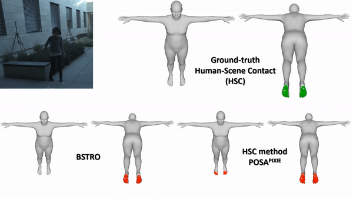

# BSTRO: Body-Scene contact TRansfOrmer

This is the code repository for [Capturing and Inferring Dense Full-BodyHuman-Scene Contact](https://rich.is.tue.mpg.de/index.html). 

Body-Scene contact TRansfOrmer (BSTRO) is a transformer-based method that detects human-scene contact directly from pixels. In this repository, we provide the inference code of BSTRO.


  

### TODO items
- [x] ~~Release training and validation code (coming soon).~~

## Installation
Check [INSTALL.md](docs/INSTALL.md) for installation instructions.

## Pre-trained models and other required files
Please download our pre-trained weights from the [website](https://rich.is.tue.mpg.de/index.html) and follow [DOWNLOAD.md](docs/DOWNLOAD.md) to prepare other relevant files that are important to run our code. 

## Quick demo
We provide demo codes to run end-to-end inference on the test images.

Check [DEMO.md](docs/DEMO.md) for details.


## Citations
If you find our work useful in your research, please consider citing:

```bibtex
@inproceedings{huang2022rich,
    title = {Capturing and Inferring Dense Full-Body Human-Scene Contact},
    author = {Huang, Chun-Hao P. and Yi, Hongwei and H{\"o}schle, Markus and Safroshkin, Matvey and Alexiadis, Tsvetelina and Polikovsky, Senya and Scharstein, Daniel and Black, Michael J.},
    booktitle = {IEEE/CVF Conf.~on Computer Vision and Pattern Recognition (CVPR) },
    pages = {13274-13285},
    month = jun,
    year = {2022},
    month_numeric = {6}
}
```


## License

Our research code is released under the MPI license. See [LICENSE](https://rich.is.tue.mpg.de/license.html) for details.

METRO has MIT license. See [LICENSE](https://github.com/microsoft/MeshTransformer/blob/main/LICENSE) for details. 

We use [huggingface/transformers](https://github.com/huggingface/transformers) submodule. Please see [NOTICE](NOTICE.md) for details. 


## Acknowledgments

Our implementation and experiments are built on top of open-source GitHub repositories. We thank all the authors who made their code public, which tremendously accelerates our project progress. If you find these works helpful, please consider citing them as well.

[microsoft/MeshTransformer](https://github.com/microsoft/MeshTransformer)

[huggingface/transformers](https://github.com/huggingface/transformers) 

[HRNet/HRNet-Image-Classification](https://github.com/HRNet/HRNet-Image-Classification) 

[nkolot/GraphCMR](https://github.com/nkolot/GraphCMR) 

## Contact

For questions, please contact rich@tue.mpg.de

For commercial licensing (and all related questions for business applications), please contact ps-licensing@tue.mpg.de.
