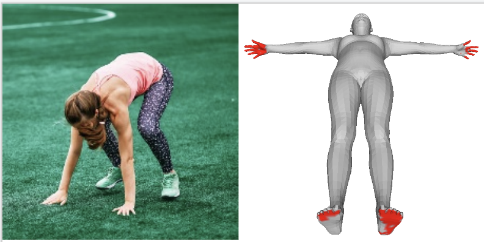

# Quick Demo 
We provide a demo inference code to estimate human-scene contact.

Our inference codes will take a image as input and generate the results.

## Human-Scene Contact Detection

This demo runs 3D human-scene contact detection from a single image. 

Our codes require the input images that are already **cropped with the person centered** in the image. The input images can have arbitrary size and the demo code scales it to `224x224`. 
Check `./samples/body-scene-contact/sample1.jpg` for example. 

Run the following script for demo:


```bash
python ./metro/tools/demo_bstro.py 
       --num_hidden_layers 4 
       --num_attention_heads 4 
       --input_feat_dim 2051,512,128 
       --hidden_feat_dim 1024,256,128 
       --input_img samples/body-scene-contact/sample4.png
       --output_dir ./demo 
       --resume_checkpoint models/bstro/hsi_hrnet_3dpw_b32_checkpoint_15.bin
```
After running, it will generate the results in the folder `./demo`. `input.jpg` is the input image in `224x224` size (as a sanity check); `contact_vis.obj` is a body mesh in T-pose where vertices in contact with the scene are in red color. Visualizing it in MeshLab, one shall see the results as in the right image below.

  

Note that BSTRO focuses on estimating *contact*, not poses or shapes. The T-posed mesh is only for visualization purposes. 

## Limitations

 - **This demo doesn't perform human detection**. Our model requires a centered target in the image. 
 - As **BSTRO is a data-driven approach**, it may not perform well if the test samples are very different from the training data. 
 - **BSTRO considers the SMPL mesh topology**. It needs vertex correspondences to transfer the results to other body meshes, e.g., SMPL-X, GHUM. 

 ## FAQ
 - Q: [This line](https://github.com/paulchhuang/bstro/blob/612099a07e02056cb852f89e3e581ce1f8a8cdd2/metro/modeling/bert/modeling_bstro.py#L202) shoots errors and looks like there is an implicit `batch_size` = 30 everywhere in the code.\
 A: [2022.08.05] We suspect this may be due to differnt environments. Check this [reply](https://github.com/paulchhuang/bstro/issues/3#issuecomment-1206277133) for a quick workaround and thanks to [@oscarfossey](https://github.com/oscarfossey) for sharing. 


